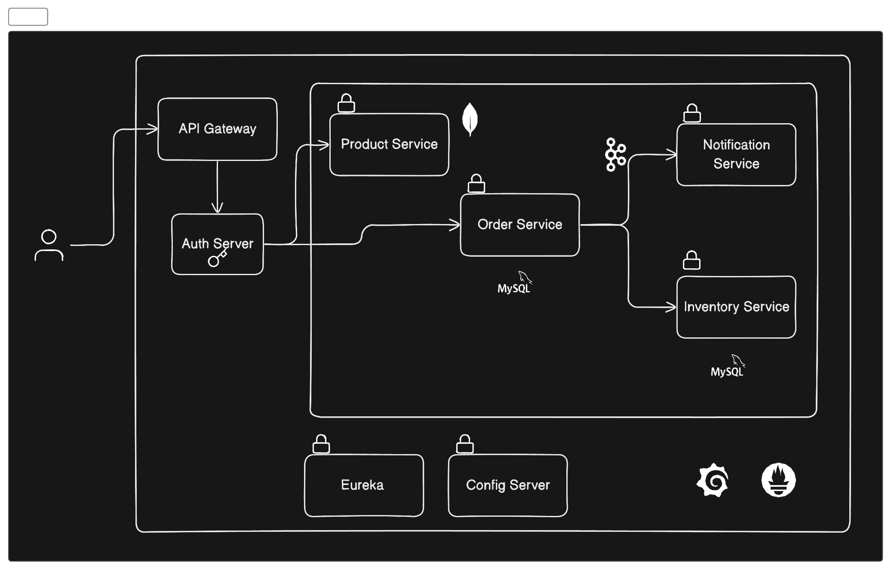

# Microservice-Based-Shopping-Application
This project aims to develop a simple online shopping application. It covers a wide range of microservices-related topics and practices, ensuring a robust, scalable, and fault-tolerant system.

## Project Architecture

Refer to the provided architecture diagrams to understand how different services like Product, Order, Inventory, and Notification interact and how they are orchestrated.

## Features

- **Service Discovery**: Implementing Eureka to allow services to find and communicate with each other without hardcoding hostname and port.
- **Centralized Configuration**: Using Spring Cloud Config Server for maintaining external configurations across different environments.
- **Distributed Tracing**: Employing Spring Cloud Sleuth and Zipkin for tracing requests and pinpointing failures in a distributed system.
- **Event-Driven Architecture**: Leveraging Kafka for asynchronous communication between microservices.
- **Centralized Logging**: Utilizing Logstash, Elasticsearch, and Kibana for logging and monitoring.
- **Circuit Breaker**: Integrating Resilience4j to provide fallback options and maintain performance during partial system failure.
- **Security**: Securing microservices with Keycloak for identity and access management.

## API Gateway

The API Gateway acts as the front-door for all requests to the microservices, providing:

- Request routing based on headers
- Authentication and Security
- Load balancing
- SSL termination

## Security with Keycloak

Keycloak is integrated for robust authentication and authorization. It secures the services by ensuring only authenticated and authorized users have access.

## Circuit Breaker with resilience4j

`resilience4j` provides a circuit breaker functionality to prevent system failure and ensure the system degrades gracefully during partial outages.

## Distributed Tracing

Spring Cloud Sleuth and Zipkin are used for distributed tracing, which helps in understanding how requests travel through microservices.

## Event-Driven Architecture

The application uses Kafka to implement an event-driven architecture, enabling services to react to events such as placing an order.

## Dockerization

- **Dockerfile**: For containerizing applications and ensuring consistency across environments.
- **Docker Compose**: To define and run multi-container Docker applications in a microservices setup.

## Building Java Containers with Jib

Jib is used for building optimized Docker and OCI images for Java applications without a Dockerfile.

## Monitoring with Prometheus and Grafana

Prometheus for monitoring and Grafana for visualization are configured to monitor the performance of microservices.
